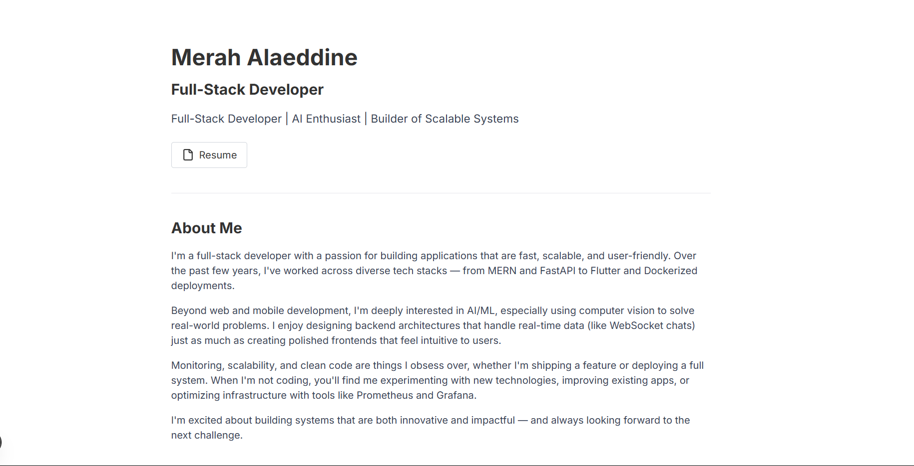
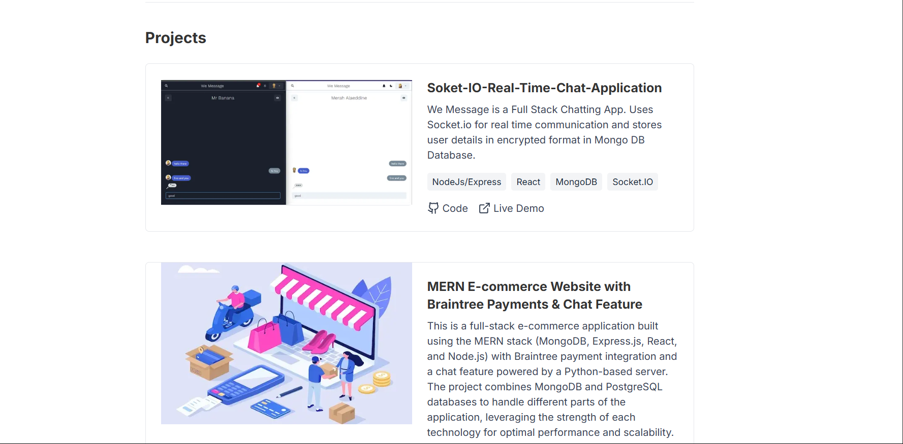
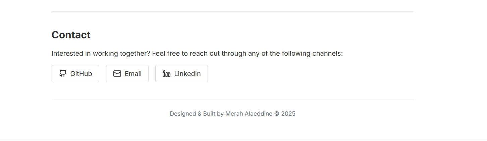

### Developer Portfolio - Classic Simple Design

A clean, minimalist developer portfolio built with Next.js and Tailwind CSS. This portfolio features a classic design that focuses on content readability and simplicity.

## 🚀 Features

- **Clean, Classic Design** - Intentionally simple and elegant layout
- **Fully Responsive** - Looks great on all devices (mobile, tablet, desktop)
- **Project Showcase** - Highlight your projects with descriptions and tech stacks
- **Easy to Customize** - Simple structure makes it easy to modify for your needs
- **Performance Optimized** - Fast loading times and optimized images
- **SEO Friendly** - Built with best practices for search engine optimization

## 💻 Technologies Used

- [Next.js](https://nextjs.org/) - React framework for production
- [Tailwind CSS](https://tailwindcss.com/) - Utility-first CSS framework
- [TypeScript](https://www.typescriptlang.org/) - Static type checking
- [Lucide Icons](https://lucide.dev/) - Beautiful open-source icons

## 📋 Prerequisites

- Node.js 18.x or higher
- npm or yarn

## 🔧 Installation

1. Clone the repository:

```shellscript
git clone https://github.com/DrLivesey-Shura/my-developer-portfolio.git
cd my-developer-portfolio
```

2. Install dependencies:

```shellscript
npm install
# or
yarn install
```

3. Run the development server:

```shellscript
npm run dev
# or
yarn dev
```

4. Open [http://localhost:3000](http://localhost:3000) in your browser to see the result.

## 🛠️ Customization

### Personal Information

Edit the `app/page.tsx` file to update:

- Your name and title
- Social media links
- About Me section

### Projects

Update the projects in `lib/data.ts`:

```typescript
export const projects: ProjectType[] = [
  {
    project: 1,
    title: "Your Project Title",
    description: "Project description goes here...",
    techStack: ["Tech1", "Tech2", "Tech3"],
    githubLink: "https://github.com/yourusername/project",
    liveLink: "https://your-project-demo.com",
    image: "/images/your-project-image.png",
  },
  // Add more projects...
];
```

### Images

Replace the placeholder images in the `public/images/` directory with your own project screenshots.

### Styling

The portfolio uses Tailwind CSS for styling. You can customize the colors, fonts, and other design elements by editing:

- `app/globals.css` - For global styles
- `tailwind.config.ts` - For Tailwind configuration

## 📷 Screenshots





## 📬 Contact

If you have any questions or suggestions, feel free to reach out:

- GitHub: [@DrLivesey-Shura](https://github.com/DrLivesey-Shura)
- Email: [merahalaeddine02@gmail.com](mailto:merahalaeddine02@gmail.com)
- LinkedIn: [Merah Alaeddine](https://www.linkedin.com/in/merah-alaeddine-599b72263/)

---

Feel free to star ⭐ this repository if you find it useful!
